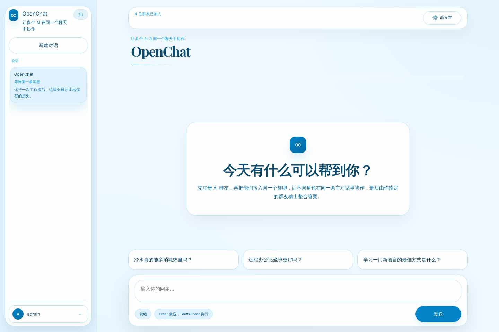
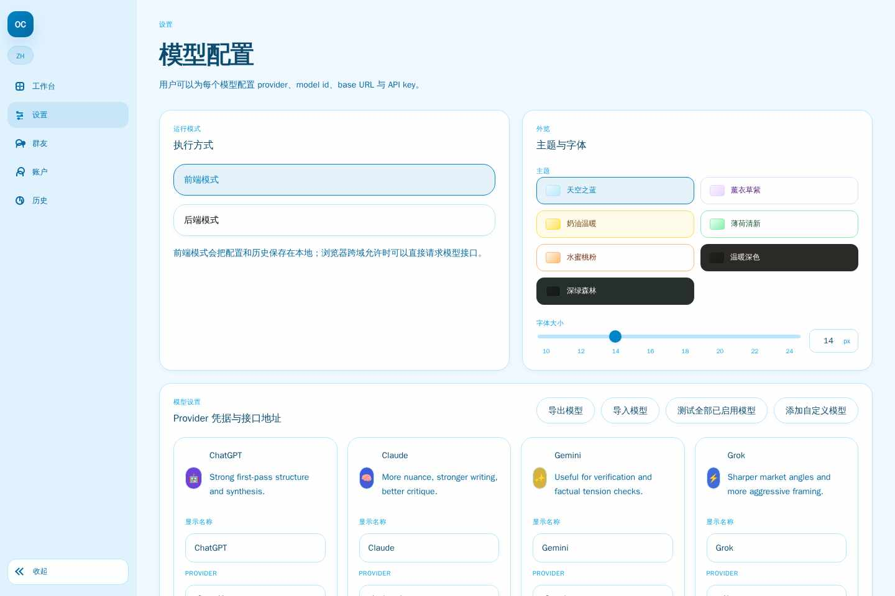
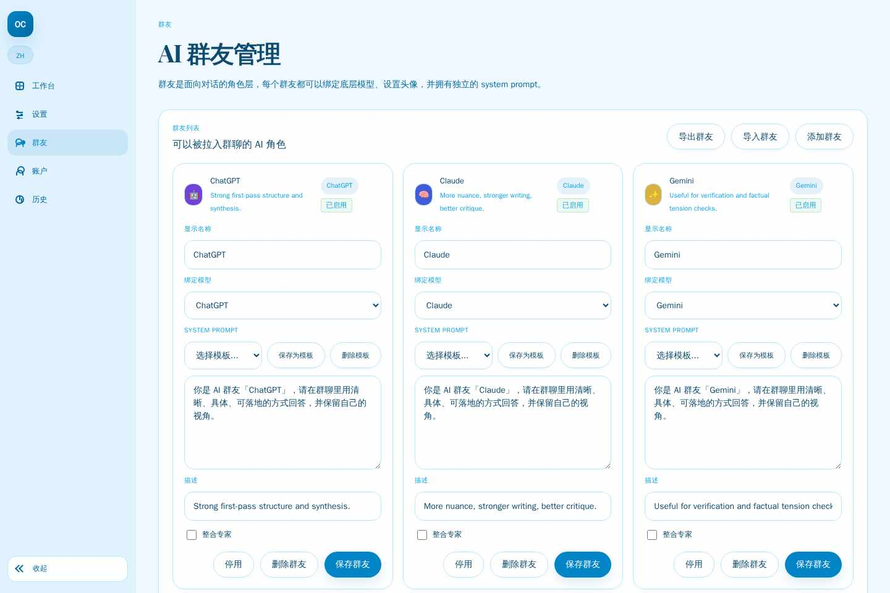

# OpenChat

[English](./README_en.md)

OpenChat 是一个多模型 AI 协作工作区。你可以把同一条问题同时发给多个模型，并排对比它们的回答，再在需要时由指定的「整合专家」汇总出综合结论。适合做方案对照、群聊讨论、角色协作与结论汇总。

## 在线体验

- 演示地址：https://openchat.sumsec.me/

## 核心功能

- **多模型并行对话**：同一条消息可同时发送给多个 AI 群友，集中对比不同模型的回答。
- **按需 AI 总结（整合专家）**：指定一位群友作为「整合专家」，对比完多模型回答后，点击「总结群友」**按需**生成综合结论——只总结最近一轮，且仅基于回答正文（不含思维链）。总结结果会保留，可作为后续对话的基础。
- **仅与专家对话**：勾选后，后续轮次只与整合专家继续对话，在已有总结 / 正文的基础上追问，不再重复请求全部群友。
- **随时停止生成**：流式过程中可点击「停止」中断本轮，已输出的内容会保留。
- **消息级操作**：每条模型回答支持「重新生成」（失败即重试），用户消息支持「编辑重发」。
- **图片 / 多模态输入**：可附带图片随提示词发送给支持视觉的模型（前端 / 后端模式均支持）。
- **群友编排与角色设定**：为每个 AI 群友绑定模型、设置头像、描述与系统提示词。
- **群组设置**：支持共享系统提示词、成员选择、平台能力偏好等会话级配置。
- **流式消息渲染**：实时输出回答内容，适合长文本、代码块和逐步生成场景。
- **Markdown / 代码高亮 / Mermaid / 数学公式**：面向 AI 内容展示做了增强，便于阅读复杂回复。
- **思维链折叠展示**：自动识别 `<think>` 与 reasoning 内容，减少主界面噪音。
- **会话历史管理**：保存、浏览和管理历史对话，便于复盘与追问。
- **双运行模式**：支持纯前端模式和 Node.js 后端模式，兼顾轻量部署与服务端持久化。
- **CORS 代理配置**：前端模式下可在设置中配置 CORS 代理，绕过浏览器直连模型接口的跨域限制。
- **模型配置中心**：统一管理 provider、model、base URL、API key 与启用状态。
- **主题 / 字号 / 中英文切换**：支持多主题外观、字体大小调节与双语界面。
- **前端访问密码**：适合公网部署时增加一道访问保护。

## 使用流程

1. 在「群友管理」中创建 AI 群友并绑定模型；在「模型设置」中填入 provider / Base URL / API key。
2. 回到主工作区，选择参与本轮的群友，输入问题（可附带图片）后发送。
3. 各模型并行流式作答，期间可随时「停止」，也可对单条回答「重新生成」或对自己的消息「编辑重发」。
4. 需要结论时点击「总结群友」，由整合专家基于本轮回答正文生成综合答案。
5. 如需深入，勾选「仅与专家对话」，在已有总结的基础上只与专家继续追问。

## 功能截图

### 1. 主工作区：多模型群聊与综合回答



### 2. 模型设置：运行模式、主题与模型配置



### 3. 群友管理：配置 AI 角色与系统提示词



## 页面说明

| 页面 | 路径 | 说明 |
|---|---|---|
| 主工作区 | `index.html` | 多模型对话、综合回答、消息流展示 |
| 模型设置 | `settings.html` | 运行模式、CORS 代理、主题、字体、模型配置 |
| 群友管理 | `friends.html` | AI 群友管理、角色提示词、模型绑定 |
| 账号页面 | `auth.html` | 本地账号注册与展示 |
| 历史会话 | `history.html` | 历史记录浏览与管理 |

## 运行模式

### Frontend mode（前端模式）

- 所有数据保存在浏览器 `localStorage`
- 浏览器直接请求模型提供商接口
- 适合本地体验、静态托管和快速部署

### Backend mode（后端模式）

- Node.js 服务端提供 `/api/*` 路由
- 数据持久化到 `.data/openchat-db.json`
- API key 由服务端管理
- 更适合长期使用或需要统一数据存储的场景

## 快速开始

### 安装依赖

```bash
npm install
```

### 启动前端开发环境

```bash
npm run dev
```

访问：`http://127.0.0.1:9090`

### 启动后端服务

```bash
npm run dev:server
```

访问：`http://127.0.0.1:8787`

### 构建产物

```bash
npm run build
npm run preview
```

### 运行测试

```bash
npm test

# 单测文件示例
node --test src/__tests__/frontend-auth.test.mjs
```

## 常用命令

```bash
npm install          # 安装依赖
npm run dev          # 前端开发服务
npm run dev:server   # Node 后端服务
npm run build        # 构建 dist/
npm run preview      # 预览构建结果
npm test             # 运行测试
npm run start        # 启动后端服务
```

## 技术栈

- **前端**：Vanilla JS + React 19
- **样式**：Tailwind CSS v4
- **组件**：shadcn/ui + AI Elements
- **状态管理**：Zustand
- **构建工具**：Vite
- **后端**：Node.js 原生 HTTP Server
- **AI SDK**：Vercel AI SDK
- **Markdown 渲染**：Streamdown
- **测试**：Node 内置测试运行器

## 后端 API

```text
GET  /api/account
POST /api/auth/register
GET  /api/models
POST /api/models
GET  /api/friends
POST /api/friends
GET  /api/group-settings
POST /api/group-settings
GET  /api/conversations
POST /api/conversations
POST /api/chat/run
POST /api/chat/run/stream
```

## 数据存储

后端模式下，数据默认保存在：

```text
.data/openchat-db.json
```

主要数据包括：

- account
- models
- friends
- groupSettings
- conversations

## 部署说明

OpenChat 有两种部署形态，分别对应两种运行模式。前端基于 Vite 构建，**部署前需先 `npm run build` 生成 `dist/`**（不能直接用源码运行）。

### 形态 A：纯前端 / 静态部署（推荐）

对应 **Frontend mode**：API key 存浏览器、浏览器直连模型接口。构建后把 `dist/` 部署到任意静态托管（Vercel、Cloudflare Pages、Nginx、GitHub Pages 等）。

```bash
npm run build   # 产物在 dist/
```

#### Vercel 部署

Vercel 适合部署 **Frontend mode**（纯静态）。OpenChat 的 Node 后端是自托管 HTTP Server，不适配 Vercel 的 Serverless，因此在 Vercel 上请使用前端模式。

**方式一：导入 Git 仓库（推荐）**

1. 将仓库推送到 GitHub / GitLab / Bitbucket。
2. 在 Vercel 控制台点击 **Add New… → Project**，导入该仓库。
3. 构建设置（仓库已含 `vercel.json`，通常会自动带出）：
   - Framework Preset：`Vite`（或 `Other`）
   - Build Command：`npm run build`
   - Output Directory：`dist`
4. 点击 **Deploy**。部署完成后打开分配的域名，进入 `settings.html`，将运行模式设为 **Frontend**，并填入模型的 provider / Base URL / API key 即可使用。

**方式二：使用 Vercel CLI**

```bash
npm i -g vercel
vercel          # 预览部署
vercel --prod   # 生产部署
```

> **注意：** Vercel 域名是 HTTPS。若模型 Base URL 为 HTTP，会触发浏览器的 Mixed Content 拦截，详见下方「常见问题」。

### 形态 B：自托管 + Node 后端

对应 **Backend mode**：Node 服务（`server.mjs`）提供 `/api/*` 接口，并把数据持久化到 `.data/openchat-db.json`。前端通过**同源** `/api/*` 调用后端，因此需让静态前端与 API 处于同一域名下，推荐用反向代理收敛。

1. 构建前端：

   ```bash
   npm run build
   ```

2. 启动后端（API + 数据持久化，默认端口 8787，可用 `PORT` 覆盖）：

   ```bash
   PORT=8787 npm run start
   ```

3. 用 Nginx / Caddy 把静态 `dist/` 与 `/api/*` 收敛到同一域名并启用 HTTPS：

   ```nginx
   server {
     listen 443 ssl;
     server_name your.domain;
     # ssl_certificate ...;  ssl_certificate_key ...;

     root /path/to/OpenChat/dist;
     index index.html;

     location /api/ {
       proxy_pass http://127.0.0.1:8787;
       proxy_set_header Host $host;
     }
     location / {
       try_files $uri $uri/ /index.html;
     }
   }
   ```

4. 打开站点进入 `settings.html`，将运行模式切到 **Backend**。
5. 用 pm2 / systemd 守护后端进程，并定期备份 `.data/` 目录：

   ```bash
   npm i -g pm2
   pm2 start "npm run start" --name openchat
   pm2 save
   ```

> 所有后端数据都在 `.data/openchat-db.json`，备份或迁移时复制整个 `.data/` 目录即可。

## 常见问题

### HTTPS 页面无法请求 HTTP 模型接口（Mixed Content）

当 OpenChat 部署在 HTTPS 域名下，而模型的 Base URL 为 HTTP 地址时，浏览器会因 Mixed Content 安全策略拦截请求。

**解决方法（Chrome）：**

1. 打开模型接口所在页面（如 `https://openchat.sumsec.me/settings.html`）
2. 点击地址栏左侧的锁头图标（或 `⚙` 图标）
3. 选择「网站设置」（Site settings）
4. 找到「不安全内容」（Insecure content）选项
5. 将其改为「允许」（Allow）
6. 返回页面并刷新

**解决方法（CORS 插件）：**

如果同时遇到跨域（CORS）问题，可安装 Chrome 插件 [Allow CORS: Access-Control-Allow-Origin](https://chromewebstore.google.com/detail/lhobafahddgcelffkeicbaginigeejlf)，启用后即可解除浏览器的 CORS 限制。

**解决方法（内置 CORS 代理）：**

在「设置 → 运行模式」中填写「CORS 代理」地址（仅前端模式生效）。支持两种格式：代理前缀（如 `https://proxy/`，会拼成 `https://proxy/<目标地址>`）或带 `{url}` 占位符（如 `https://proxy/?url={url}`）。填写后，前端直连的所有模型请求都会经由该代理转发，从而绕过 CORS。留空则不使用代理。

> **注意：** 以上设置仅对当前站点生效，不会影响其他网站的安全策略。每个浏览器需单独设置。

## 许可证

MIT
