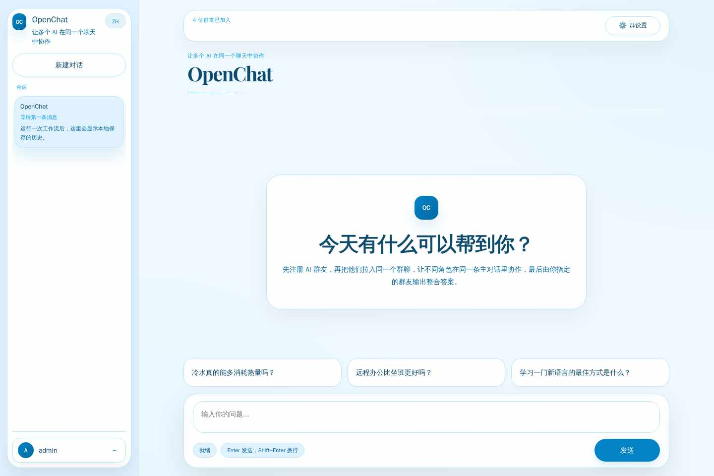
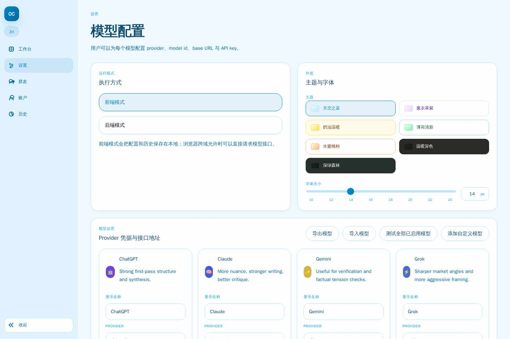
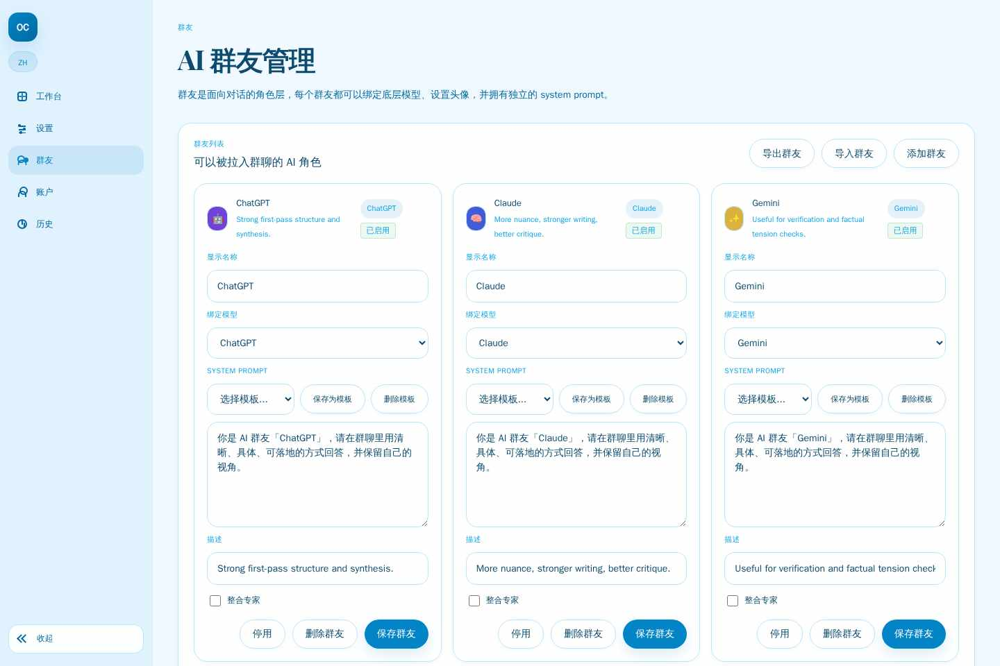

# OpenChat

[中文](./README.md)

OpenChat is a multi-model AI collaboration workspace. You can send the same prompt to multiple models at the same time, compare their responses in one place, and let a designated AI synthesize the final answer. It works well for solution comparison, group-style discussion, role-based collaboration, and conclusion merging.

## Live Demo

- Demo: https://openchat.sumsec.me/

## Core Features

- **Parallel multi-model chat**: Send one prompt to multiple AI friends at once and review their answers side by side.
- **AI synthesis expert**: Assign one friend as the synthesis role to merge multi-model outputs into a single conclusion.
- **Friend orchestration and role setup**: Configure each AI friend with its own model, avatar, description, and system prompt.
- **Group settings**: Manage shared system prompts, member selection, and platform capability preferences at the conversation level.
- **Streaming message rendering**: View responses as they are generated, which works especially well for long text, code blocks, and step-by-step output.
- **Markdown / code highlight / Mermaid / math**: Enhanced rendering for AI-generated content so complex replies stay readable.
- **Reasoning collapse**: Automatically folds `<think>` and reasoning content to reduce noise in the main chat view.
- **Conversation history**: Save, browse, and manage previous sessions for follow-up questions and review.
- **Dual runtime modes**: Supports both frontend-only mode and Node.js backend mode for lightweight deployment or server-side persistence.
- **Model configuration center**: Manage provider, model, base URL, API key, and enabled state in one place.
- **Themes / font size / bilingual UI**: Includes multiple themes, adjustable font size, and Chinese/English interface switching.
- **Frontend access password**: Adds a lightweight access gate for public deployments.

## Screenshots

### 1. Workspace: multi-model chat and synthesized answers



### 2. Settings: runtime mode, theme, and model configuration



### 3. Friends: AI role setup and prompt configuration



## Pages

| Page | Path | Description |
|---|---|---|
| Workspace | `index.html` | Multi-model chat, synthesized answers, and streaming message flow |
| Settings | `settings.html` | Runtime mode, theme, font size, and model configuration |
| Friends | `friends.html` | AI friend management, role prompts, and model binding |
| Account | `auth.html` | Local account registration and account display |
| History | `history.html` | Conversation history browsing and management |

## Runtime Modes

### Frontend mode

- All data is stored in browser `localStorage`
- The browser calls model provider APIs directly
- Best for local use, static hosting, and quick deployment

### Backend mode

- A Node.js server provides `/api/*` routes
- Data is persisted to `.data/openchat-db.json`
- API keys are managed on the server
- Better for long-term use or centralized data storage

## Quick Start

### Install dependencies

```bash
npm install
```

### Start the frontend dev server

```bash
npm run dev
```

Visit: `http://127.0.0.1:4173`

### Start the backend server

```bash
npm run dev:server
```

Visit: `http://127.0.0.1:8787`

### Build output

```bash
npm run build
npm run preview
```

### Run tests

```bash
npm test

# Example single test file
node --test src/__tests__/frontend-auth.test.mjs
```

## Common Commands

```bash
npm install          # Install dependencies
npm run dev          # Start frontend dev server
npm run dev:server   # Start Node backend server
npm run build        # Build dist/
npm run preview      # Preview the build output
npm test             # Run tests
npm run start        # Start backend server
```

## Tech Stack

- **Frontend**: Vanilla JS + React 19
- **Styling**: Tailwind CSS v4
- **Components**: shadcn/ui + AI Elements
- **State management**: Zustand
- **Build tool**: Vite
- **Backend**: Native Node.js HTTP server
- **AI SDK**: Vercel AI SDK
- **Markdown rendering**: Streamdown
- **Testing**: Node built-in test runner

## Backend API

```text
GET  /api/account
POST /api/auth/register
GET  /api/models
POST /api/models
GET  /api/friends
POST /api/friends
GET  /api/group-settings
POST /api/group-settings
GET  /api/conversations
POST /api/conversations
POST /api/chat/run
POST /api/chat/run/stream
```

## Data Storage

In backend mode, data is stored by default in:

```text
.data/openchat-db.json
```

Main data includes:

- account
- models
- friends
- groupSettings
- conversations

## Deployment

### Static deployment

Suitable for Vercel, Cloudflare Pages, and other static hosting platforms:

```bash
npm run build
```

Output directory: `dist/`

### Node server deployment

```bash
node server.mjs
```

Default port: `8787`

## License

MIT
